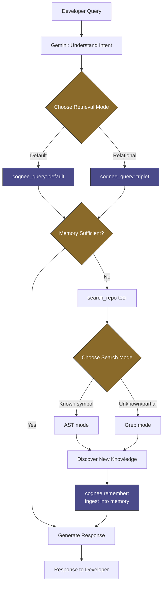

# Cortex

**An AI coding agent that remembers your repository investigation — across sessions, not just within one.**

Built for the WeMakeDevs × Cognee Hackathon — *The Hangover Part AI: Where's My Context?*

---

## The Problem

Every time an AI coding assistant starts a new session, it starts from zero. Contributors on large open-source codebases re-explain architecture, re-trace execution paths, and re-discover the same implementation details every single conversation — because nothing persists between sessions.

Cortex fixes that by giving the agent a persistent, queryable memory of everything it has ever explored in your repository.

---

## How It Works

Every query follows the same loop: **check memory first, explore only if needed, learn from what you find.**



1. **Memory first.** Gemini queries Cognee before touching the repository — `default` mode for direct facts, `triplet` mode when the question is relational ("how does this connect to the auth flow we explored earlier?").
2. **Explore only on a miss.** If memory doesn't have the answer, Cortex searches the actual repo using `search_repo`, in either `AST` mode (known symbols — functions, classes, definitions) or `grep` mode (partial snippets, log lines, unknown identifiers).
3. **Learn automatically.** Whatever gets discovered — file content and folder structure, stored as separate linked facts — is written back into Cognee's knowledge graph. The next query, next session, next contributor benefits from it.

The repository's code stays in Git. The *understanding* of the repository lives in Cognee.

---

## Why This Matters

> **Day 1** — "Where is `authenticate_user` implemented?" → Cortex explores, stores the authentication architecture.
> **Day 3** — "How does refresh token validation work?" → Cortex already knows the auth flow, explores only the missing piece.
> **Day 7** — "Continue our authentication investigation." → Cortex picks up exactly where it left off — no re-explaining, no re-exploring.

This is the actual problem open-source contributors face on large codebases: not a lack of AI assistance, but AI assistance with no memory of the last conversation.

---

## Stack

- **Orchestration:** Gemini function calling (`gemini-2.5-flash-lite`)
- **Memory:** Cognee — `remember` / `recall` (default + triplet modes)
- **Repository search:** `search_repo` — AST and grep modes
- **Output:** Structured `CortexResponse` schema on every call

---

## Known Tradeoffs

Built in a one-week hackathon window — GitHub integration (PR/issue-linked memory) was scoped and intentionally cut to keep the core memory loop stable and fully tested rather than shipping a half-integrated feature.

---

## Demo

*(video link here)*

---

## Run Locally

```bash
git clone <repo-url>
cd cortex
pip install -r requirements.txt
cp .env.example .env   # fill in the values below
python function_calling.py
```

### .env Structure

```bash
# Gemini — orchestration / function calling
GEMINI_API_KEY=

# Cognee — LLM used internally for cognify / GRAPH_COMPLETION
LLM_API_KEY=
LLM_PROVIDER=
LLM_MODEL=

# Cognee — embeddings
EMBEDDING_API_KEY=
EMBEDDING_PROVIDER=
EMBEDDING_MODEL=

# Required — without this, dataset creation and access will fail
ENABLE_BACKEND_ACCESS_CONTROL=false
```

`ENABLE_BACKEND_ACCESS_CONTROL=false` is required. Without it, Cognee's dataset access control blocks reads/writes in a way that's easy to misdiagnose as a memory or ingestion bug.
